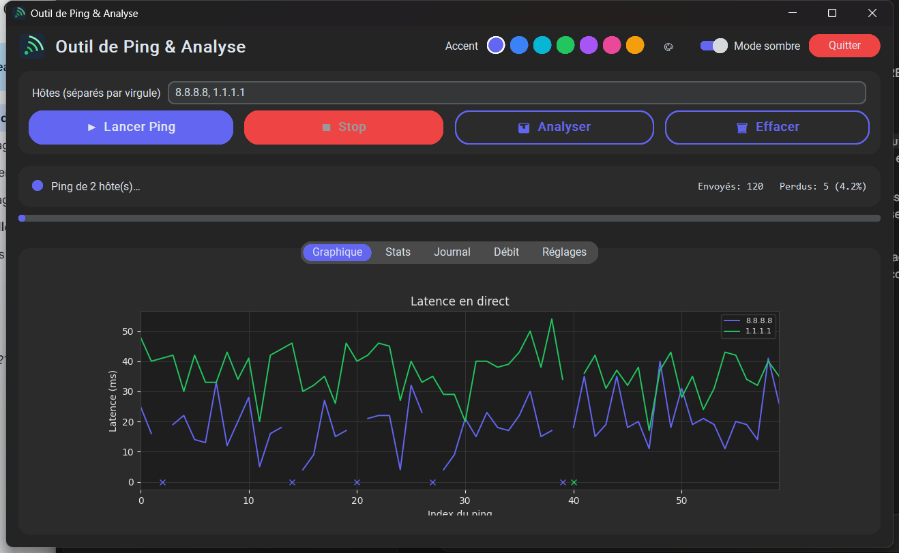
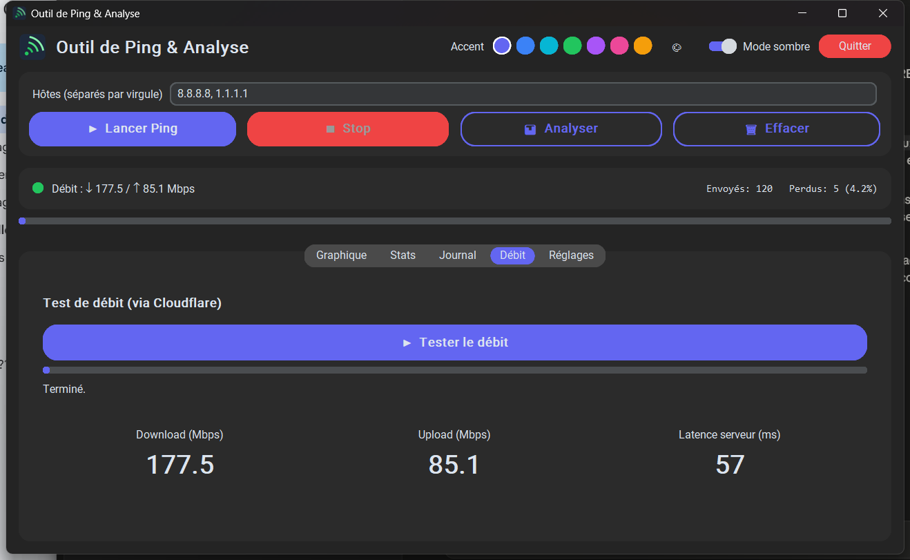

# PingTester

Outil de **test et de surveillance de ping** pour Windows, avec interface graphique moderne :
graphique de latence en **temps réel**, surveillance **multi-hôtes**, statistiques de qualité,
alertes, thème clair/sombre et export CSV/PNG.




## Fonctionnalités

- 📈 **Graphique de latence en direct** intégré (une courbe par hôte).
- 🌐 **Multi-hôtes simultanés** — comparez plusieurs cibles (box, DNS, site) pour diagnostiquer
  d'où vient un problème (routeur vs FAI vs serveur).
- 📊 **Onglet Stats** — tableau par hôte (envoyés, perte %, latence moyenne, gigue) et un
  **score de qualité A-F**.
- 🚀 **Test de débit** — onglet dédié : mesure **Download + Upload** (Mbps) et **latence
  serveur** via Cloudflare (bibliothèque standard, sans dépendance ajoutée), barre de
  progression, annulable en cours de test.
- ⏱ Ping sur **durée fixe** ou **en continu**, **intervalle réglable**, bouton **Stop**.
- 🔔 **Alertes** sur dépassement de seuil ou coupure : **son + clignotement** de la barre des tâches.
- 🎨 Interface **CustomTkinter** : coins arrondis, **thème clair/sombre**, **couleur d'accent**
  personnalisable.
- 💾 **Préférences mémorisées** entre les sessions (`~/.pingtester.json`).
- 🪟 La croix **réduit dans la barre des tâches** (le ping continue) ; bouton **Quitter** dédié.
- 📤 **Analyse hors-ligne** d'un journal : export **CSV** (min/max/moyenne/médiane/écart-type/gigue,
  par hôte) + **graphiques PNG**.
- 🇫🇷🇬🇧 Détection des réponses ping en **français et anglais**.

## Installation

Prérequis : **Windows** et **Python 3.10+**.

```bash
pip install -r requirements.txt
```

## Utilisation

```bash
python ping_tool_gui2.py
```

1. Saisir un ou plusieurs **hôtes** séparés par des virgules (ex. `8.8.8.8, 1.1.1.1`).
2. Cliquer sur **▶ Lancer Ping** : la courbe se trace en direct, l'onglet **Stats** se met à jour.
3. Ajuster durée, intervalle, seuil d'alerte et fichiers dans l'onglet **Réglages**.
4. **📊 Analyser** relit le fichier journal et génère le CSV + les graphiques PNG.

## Compiler un exécutable (.exe)

```bash
pip install pyinstaller
python -m PyInstaller --onefile --windowed --name PingTester ^
    --icon ping_tool_ico.ico --add-data "ping_tool_ico.ico;." ^
    --collect-all customtkinter ping_tool_gui2.py
```

Le résultat est dans `dist\PingTester.exe` (autonome, sans Python requis).

## Téléchargement

Un exécutable prêt à l'emploi est disponible dans la
**[dernière release](https://github.com/Ultra0Magnus/PingTester/releases/latest)**.

> ⚠️ L'exe n'est pas signé : Windows SmartScreen peut afficher un avertissement
> (*Informations complémentaires → Exécuter quand même*). Sur les postes soumis à une stratégie
> **Device Guard / WDAC** stricte, lancez plutôt la version Python.

## Aperçu

| Onglet Graphique | Onglet Débit |
|---|---|
|  |  |

## Structure du projet

| Fichier | Rôle |
|---|---|
| `ping_tool_gui2.py` | **Application principale** (interface complète, recommandée) |
| `ping_tool.py` | Version en ligne de commande (modes `ping` / `analyze`) |
| `ping_tool_gui.py` | Ancienne interface (héritée, conservée pour référence) |
| `ping_tool_ico.ico` | Icône de l'application |
| `requirements.txt` | Dépendances Python |

## Remarques

- Outil **spécifique à Windows** (utilise `ping -n`).
- Les préférences sont enregistrées dans `~/.pingtester.json` à la fermeture.
- Dépendances principales : `customtkinter`, `matplotlib`, `pillow`.
