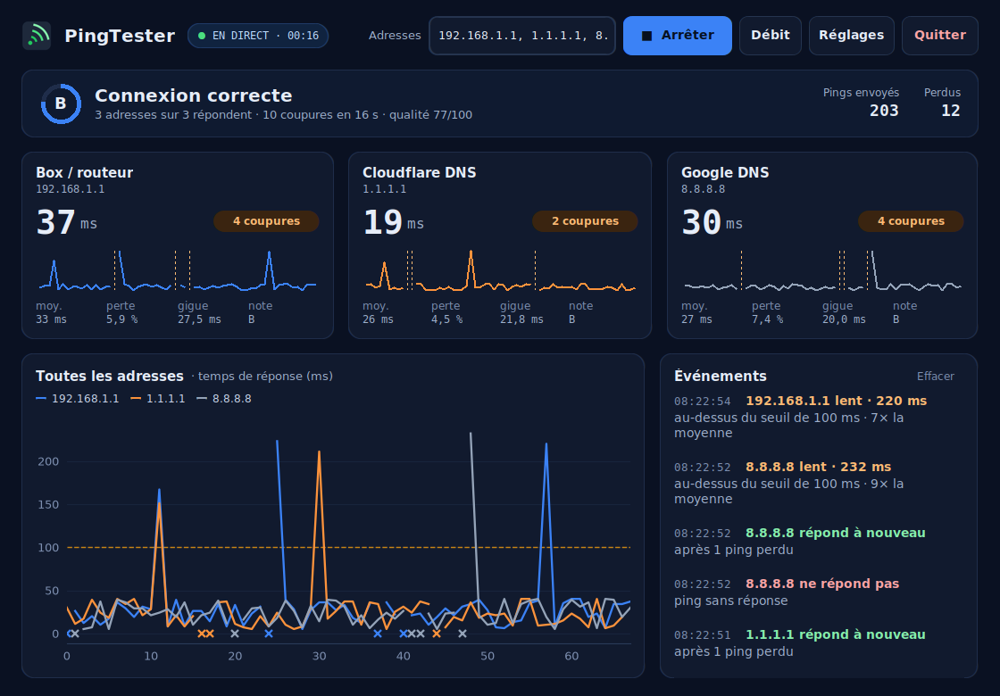
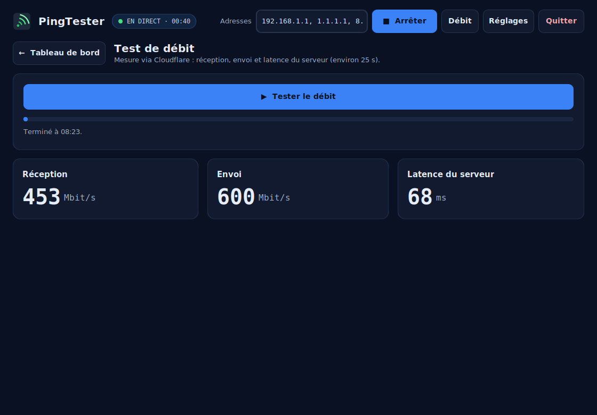

# PingTester

Outil de **test et de surveillance de ping** pour Windows, avec une interface sombre « Nuit » :
un **diagnostic en clair**, une carte par adresse, un graphique de latence en **temps réel**,
un fil d'**événements**, des alertes, un test de débit et l'export CSV/PNG.




## Fonctionnalités

- 🩺 **Diagnostic en clair** — un bandeau résume l'état (« Tout va bien », « Connexion
  ralentie », « Coupure en cours »…) avec un **score de qualité A-F**.
- 🌐 **Multi-adresses simultanées** — comparez box, DNS et site pour savoir d'où vient un
  problème (routeur vs FAI vs serveur). Chaque adresse a sa **carte** : nom lisible (Box /
  routeur, Cloudflare DNS…), état, dernière latence, mini-graphe, moyenne, perte, gigue et note.
- 📈 **Graphique de latence en direct** (une courbe par adresse, fenêtre glissante des
  1 800 derniers pings — les statistiques couvrent toute la session).
- 🧾 **Fil d'événements** — coupures, lenteurs et retours à la normale, en français courant ;
  le journal détaillé de chaque ping reste accessible.
- 🚀 **Test de débit** — écran dédié : **réception + envoi** (Mbit/s) et **latence du serveur**
  via Cloudflare (bibliothèque standard, sans dépendance ajoutée), annulable en cours de test.
- ⏱ Ping sur **durée fixe** ou **en continu**, **intervalle réglable**, bouton **Stop**.
- 🔔 **Alertes** sur dépassement de seuil ou coupure : **son + clignotement** de la barre des tâches.
- 🎨 Interface **CustomTkinter** sombre, **4 accents bleus** au choix dans les Réglages.
- 💾 **Préférences mémorisées** entre les sessions (`~/.pingtester.json`).
- 🪟 La croix **réduit dans la barre des tâches** (le ping continue) ; bouton **Quitter** dédié.
- 📤 **Analyse hors-ligne** d'un journal : export **CSV** (min/max/moyenne/médiane/écart-type/gigue,
  par hôte) + **graphiques PNG**.
- 🇫🇷🇬🇧 Détection des réponses ping en **français et anglais**.

## Installation

Prérequis : **Windows** et **Python 3.10+**.

```bash
pip install -r requirements.txt
```

## Utilisation

```bash
python ping_tool_gui2.py
```

1. Saisir une ou plusieurs **adresses** en haut, séparées par des virgules
   (ex. `192.168.1.1, 1.1.1.1, 8.8.8.8`).
2. Cliquer sur **▶ Démarrer** : le diagnostic, les cartes, la courbe et les événements se mettent
   à jour en direct. **■ Arrêter** termine la surveillance.
3. **Réglages** : mode continu ou durée fixe, intervalle, seuil d'alerte, alertes, couleur
   d'accent et fichiers.
4. **Réglages → Analyser le fichier journal** relit un journal et génère le CSV + les graphiques PNG.

## Compiler un exécutable (.exe)

```bash
pip install pyinstaller
python -m PyInstaller --onefile --windowed --name PingTester ^
    --icon ping_tool_ico.ico --add-data "ping_tool_ico.ico;." ^
    --collect-all customtkinter ping_tool_gui2.py
```

Le résultat est dans `dist\PingTester.exe` (autonome, sans Python requis).

## Téléchargement

Un exécutable prêt à l'emploi est disponible dans la
**[dernière release](https://github.com/Ultra0Magnus/PingTester/releases/latest)**.

> ⚠️ L'exe n'est pas signé : Windows SmartScreen peut afficher un avertissement
> (*Informations complémentaires → Exécuter quand même*). Sur les postes soumis à une stratégie
> **Device Guard / WDAC** stricte, lancez plutôt la version Python.

## Aperçu

| Tableau de bord | Test de débit |
|---|---|
|  |  |

## Structure du projet

| Fichier | Rôle |
|---|---|
| `ping_tool_gui2.py` | **Application principale** (interface complète, recommandée) |
| `ping_core.py` | Cœur sans interface (ping, lecture du journal, stats, export CSV/PNG, test de débit), partagé par l'interface et la ligne de commande |
| `ping_tool.py` | Version en ligne de commande (modes `ping` / `analyze`), même format de journal que l'interface |
| `ping_tool_gui.py` | Ancienne interface (héritée, conservée pour référence) |
| `ping_tool_ico.ico` | Icône de l'application |
| `requirements.txt` | Dépendances Python |

## Remarques

- Outil **spécifique à Windows** (utilise `ping -n`).
- Les préférences sont enregistrées dans `~/.pingtester.json` à la fermeture.
- Dépendances principales : `customtkinter`, `matplotlib`, `pillow`.
